  

  
  
  
  

### Projects

A prompt management tool with a playground that support has version history, a prompt evaluator, and browser extensions for Chrome, Firefox and Edge.

 

A course search site for developers. It collects courses from Coursera, Udemy, edX and other platforms, along with their prices and details.

### Tech Stack

      

  

